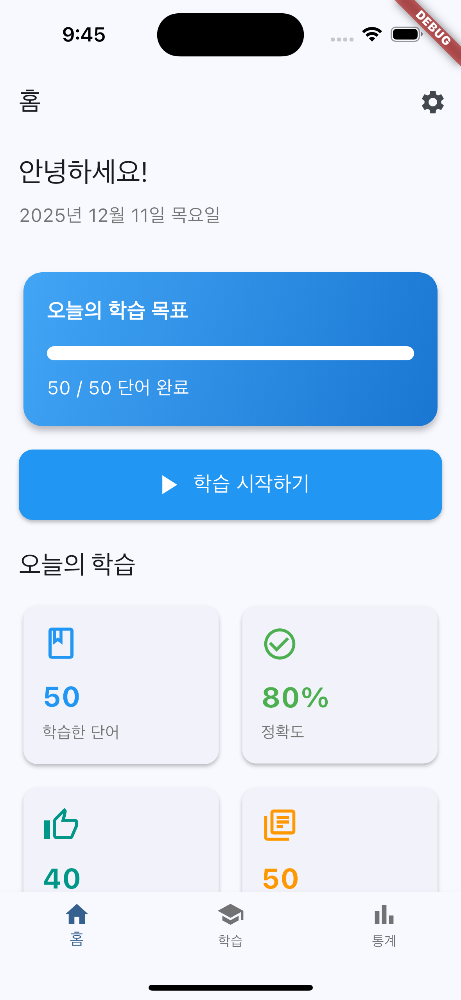
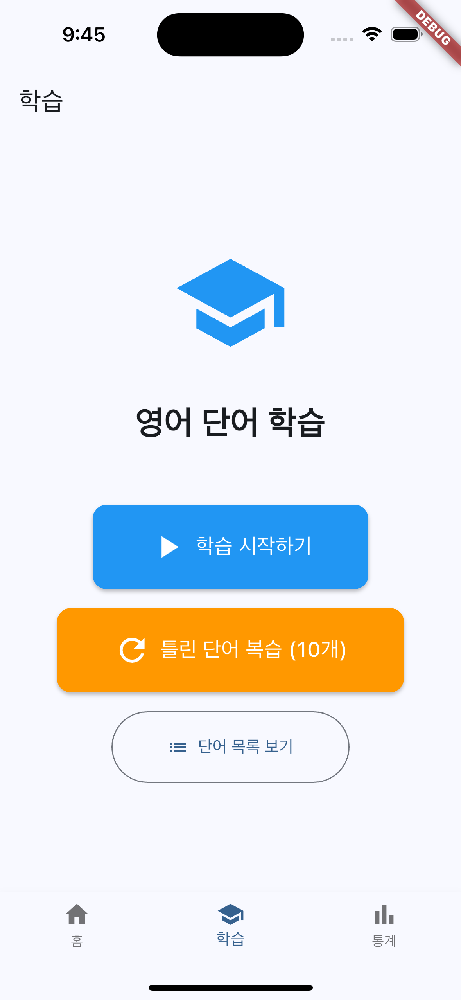
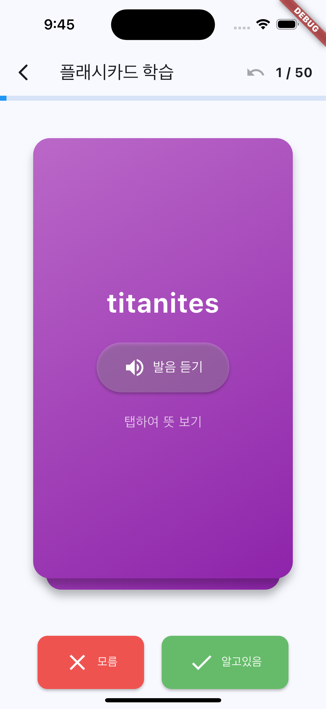
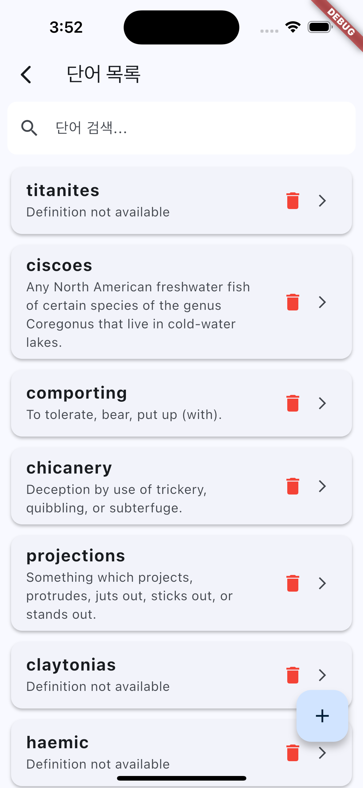
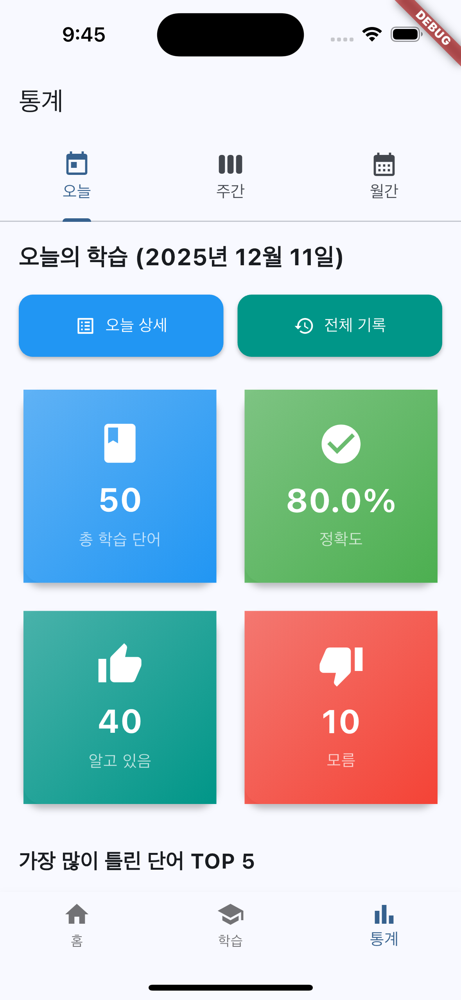
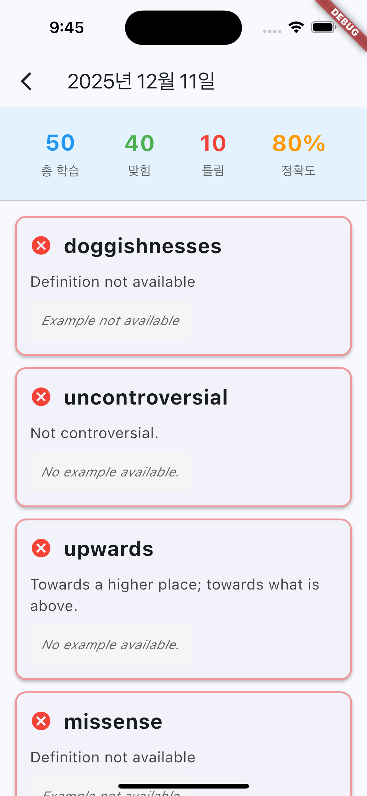
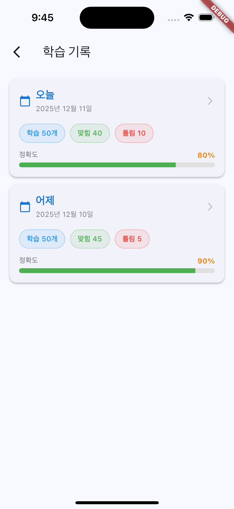
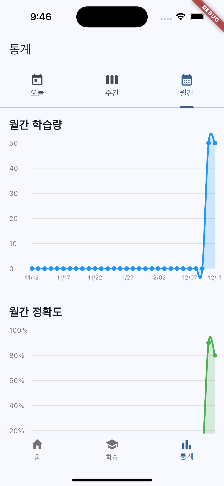
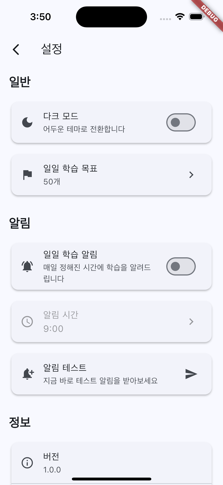

# Daily Voca - 영어 단어 학습 앱

매일 꾸준히 영어 단어를 학습하고 복습할 수 있는 플래시카드 기반 학습 앱입니다.

## 주요 기능

### 학습 기능
- **플래시카드 학습**: 카드를 넘기며 단어와 뜻을 학습
- **발음 듣기**: TTS(Text-to-Speech) 기능으로 정확한 영어 발음 제공
- **복습 모드**: 틀린 단어만 모아서 집중 복습
- **일일 학습 목표**: 개인 맞춤 학습량 설정

### 통계 및 진도 관리
- **학습 통계**: 오늘/주간/월간 학습 데이터 시각화
- **정확도 추적**: 실시간으로 학습 성과 확인
- **학습 기록**: 날짜별 학습 이력 저장 및 조회

### 단어 관리
- **단어 검색**: 영어 단어 또는 한글 뜻으로 검색
- **CRUD 기능**: 단어 추가, 수정, 삭제 완벽 지원
- **스와이프 삭제**: 직관적인 제스처로 단어 삭제

### 개인화 설정
- **다크 모드**: 눈의 피로를 줄이는 어두운 테마
- **학습 알림**: 매일 정해진 시간에 학습 리마인더
- **일일 목표 설정**: 개인의 학습 속도에 맞춘 목표 설정

## 스크린샷

<div align="center">

### 홈 화면


### 학습 화면
  

### 통계 화면
   

### 설정 화면


</div>

## 기술 스택

### 프레임워크 & 언어
- **Flutter 3.x** - 크로스 플랫폼 모바일 앱 개발
- **Dart** - Flutter의 공식 프로그래밍 언어

### 상태 관리
- **Provider 패턴** - 효율적인 상태 관리
  - WordProvider: 단어 데이터 관리
  - StatisticsProvider: 통계 데이터 관리
  - SettingsProvider: 앱 설정 관리
  - ThemeProvider: 테마 관리

### 데이터 저장
- **SQLite** (sqflite) - 로컬 데이터베이스
- **SharedPreferences** - 간단한 키-값 저장

### 주요 패키지
- `provider` - 상태 관리
- `sqflite` - SQLite 데이터베이스
- `flutter_tts` - 텍스트 음성 변환
- `fl_chart` - 학습 통계 차트
- `intl` - 날짜/숫자 포맷팅
- `shared_preferences` - 로컬 설정 저장
- `flutter_local_notifications` - 알림 기능

## 프로젝트 구조

```
lib/
├── main.dart                 # 앱 진입점
├── models/                   # 데이터 모델
│   ├── word.dart            # 단어 모델
│   └── study_record.dart    # 학습 기록 모델
├── providers/               # Provider 상태 관리
│   ├── word_provider.dart   # 단어 관리
│   ├── statistics_provider.dart
│   ├── settings_provider.dart
│   └── theme_provider.dart
├── screens/                 # UI 화면
│   ├── home_screen.dart
│   ├── flashcard_study_screen.dart
│   ├── word_list_screen.dart
│   ├── statistics_screen.dart
│   └── settings_screen.dart
├── services/                # 비즈니스 로직
│   ├── database_service.dart
│   ├── word_api_service.dart
│   └── notification_service.dart
└── widgets/                 # 재사용 가능한 위젯

test/
└── providers/               # 단위 테스트
    └── word_provider_test.dart (15 tests)
```

## 아키텍처

### 3계층 구조
```
┌─────────────────────────────────────┐
│   UI Layer (Screens & Widgets)      │
│   - Consumer로 Provider 구독         │
│   - 사용자 인터랙션 처리              │
└──────────────┬──────────────────────┘
               │
┌──────────────▼──────────────────────┐
│   Business Logic (Providers)        │
│   - 상태 관리 (ChangeNotifier)       │
│   - 데이터 변환 및 캐싱               │
└──────────────┬──────────────────────┘
               │
┌──────────────▼──────────────────────┐
│   Data Layer (Services)             │
│   - SQLite 데이터베이스 접근          │
│   - API 통신                         │
└─────────────────────────────────────┘
```

### Provider 패턴 적용
- **11개 화면**에 Provider 패턴 적용 (85% 커버리지)
- **상태 자동 동기화**: 단어 추가/수정/삭제 시 모든 화면 자동 업데이트
- **메모리 최적화**: 단어 목록 캐싱으로 DB 읽기 최소화

## 테스트

**WordProvider 테스트** (15개)
- ✅ 초기화 상태 검증
- ✅ CRUD 기능 테스트
- ✅ 검색 기능 테스트
- ✅ 에러 처리 테스트
- ✅ 상태 관리 검증

```
All tests passed! (15/15) ✅
```

### 사전 요구사항
- Flutter SDK 3.0 이상
- Dart SDK 2.17 이상

## 개발 하이라이트

### 핵심 기술 역량

1. **Provider 패턴 마스터**
   - 85% 화면에 일관된 상태 관리 적용
   - Consumer/Provider.of 적절한 활용
   - 메모리 누수 방지 (dispose 패턴)

2. **SQLite 데이터베이스 설계**
   - 정규화된 테이블 구조
   - 효율적인 쿼리 작성
   - 트랜잭션 처리

3. **테스트 주도 개발 (TDD)**
   - 15개 단위 테스트 작성
   - 체계적인 테스트 구조 (group, setUp)
   - 에러 케이스 포함

4. **사용자 경험 최적화**
   - 로딩 상태 관리
   - 에러 피드백 (SnackBar)
   - 직관적인 제스처 (스와이프 삭제)

## 향후 개발 계획

- [ ] Widget 테스트 추가
- [ ] 클라우드 동기화 (Firebase)
- [ ] 단어장 공유 기능
- [ ] 단어 암기 게임 모드
- [ ] 영영 사전 연동
- [ ] 영단어 + 단어 뜻(한글로) + 예문 구조인 API적용
